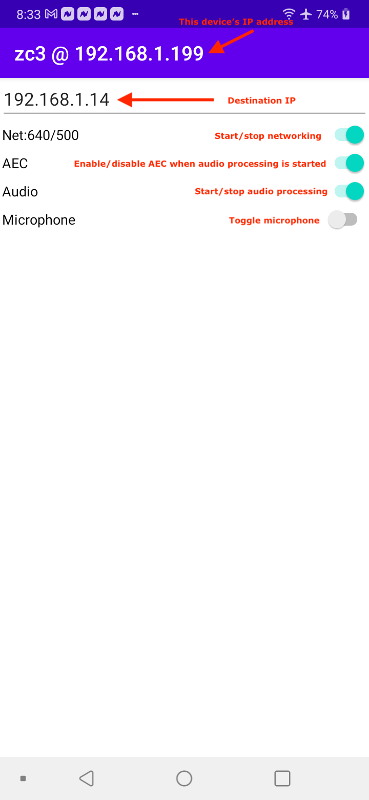

# zc3
This is a simple little Android project to test various approaches to acoustic echo cancellation, noise suppresion, and other Android audio goodies.

## Internal Operation
The app operates by capturing PCM audio from the microphone and queuing the captured buffer.  This is done by `MyRecordingThread`.  The queue is then flushed to the network by MySenderThread as unsignaled, uncompressed, headerless UDP packets.  Each packet consists of up to NET_PAYLOAD_SIZE_IN_BYTES bytes of audio data.  That audio data comes from the microphone as 16-bit integers, so each buffer of captured audio is first converted to an array of bytes (litte endian order), and then chunked into individual packets of up to NET_PAYLOAD_SIZE_IN_BYTES each. (This is done to eliminate fragmentation of the UDP packets which may adversely affect our test scenarios.)

On the receiving end, `MyReceiverThread` reads the incoming packets from the network and queues them for playout to the speaker.  This playout operation is done by `MyPlayoutThread`.

## Networking
The code supports transmission over IP multicast as well as IP unicast.  In the case of multicast, enter the same multicast IP address at the top of each instance of the app on different devices.

However, multicast is prone to failure on some networks so you can also send packets directly between two devices.  In that scenario, on one device, enter the IP address of the other device. And, likewise on the other device.  To help, each device will display its IP address in its title bar.

>Regardless of whether multicast or unicast is being used, the same port (43000) is used for 
both mediums.

## User Interaction
The UI of the app is really just a text box and a bunch of UI switches.  Be sure to operate them in the order on the UI.  

- `Text` box : Enter the destination (multicast or unicast IP address).
- `Net` switch: Toggles networking on and off by starting/stopping `MySenderThread` and `MyReceiverThread`.  The label on this switch will show `packets sent`/`packets received`.
- `AEC` switch: Toggles whether to create an Android acoustic echo canceller when the audio threads are started.
- `Audio` switch: Toggles audio (recording and playout) on and off by starting.stopping `MyRecordingThread` and `MyPlayoutThread`.
- `Microphone` switch: Toggles whether to actually transmit captured audio onto the network; or just throw it away.  Effectively mutes/unmutes the microphone.

## Notes
- There is a C++ module present in the project.  It isn't being used at the moment.
- There is zero(!!!) error checking in this app.  Be careful with it (and don't be too harsh on it).

## Results

### Noise Suppression

#### LG LMK
- Mode: MODE_IN_COMMUNICATION
- Source: VOICE_COMMUNICATION
- Usage: USAGE_VOICE_COMMUNICATION
